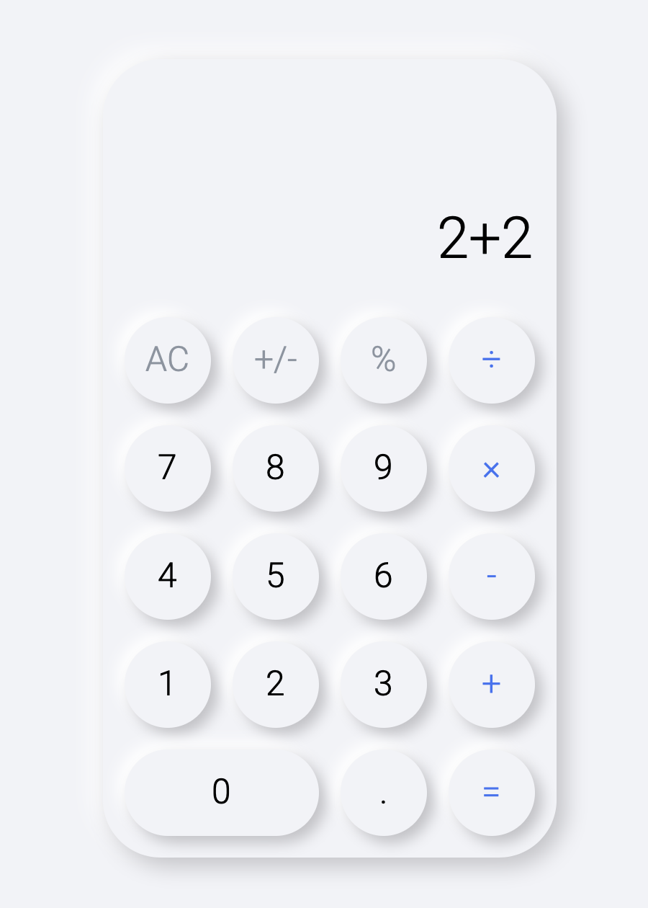

# Neomorphism calculator

The calculator app is written in pure JS, HTML, and CSS. Following guidelines of neomorphism design.

[Working example](https://hopchenko.github.io/neomorphism-calculator/)

## Improvements

### Infrastructure
- [ ] Automatic build
- [ ] Eslint configuration
- [ ] Git Hooks(husky)
- [ ] Manifest.json
- [ ] Configure environment for unit tests

### UI

- [ ] Add calculation history
- [ ] Add animation for "all clear"
- [ ] Add animation for "calculate result"
- [ ] Add change sign functionality
- [ ] Add support for different resolutions

### Code

- [ ] Cover all logic with unit tests
- [ ] Refactor functions to be pure and reusable
- [ ] Add check to double sign usage
- [ ] Separate palette from theme

